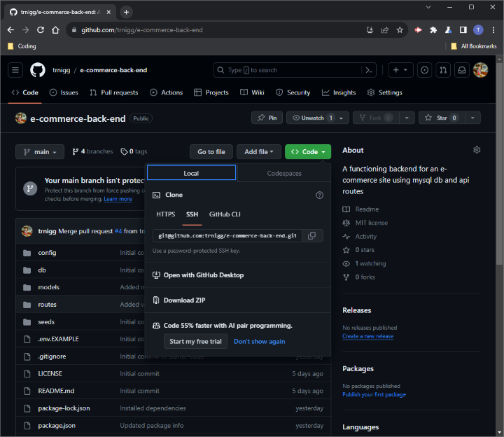

# E-commerce Back-end
(`e-commerce-back-end` - Module 13 Challenge)  

A functioning backend for an e-commerce site using mysql db and api routes

## Description
- This application allows you view and modify (insert, update and delete) the employee data in your database via the command line.
- It is written in JS using the [`Node.js`](https://nodejs.org/en) runtime environment, leveraging [`MySQL2 v^3.6.3`](https://www.npmjs.com/package/mysql2/v/3.6.3) for connecting and communicating with the `MySQL` database and using [Express v4.18.2](https://www.npmjs.com/package/express/v/4.18.2) for the web framework/server-functionality.
  - (For a full list of dependencies, please see [`package.json`](./package.json)  in the repo.)
- The project is based of a large component of starter-code that was provided as part of coursework.
- The use-case of this project is to incorporate this with an e-commerce front-end. However, to install and mimic the functionality this code provides, please follow the [description](#description) and [installation](#installation) guides below. 

## Table of Contents
- [Description](#description)
- [Installation](#installation)
- [Usage / Demo](#usage-/-demo)
    - [Usage](#usage)
    - [Demo Video](#demo-video)
- [Tests](#tests)
- [License](#license)
- [Questions](#questions)

## Installation
**Before installing the application**, please ensure you have installed [`Node.js`](https://nodejs.org/en) and `npm`.  
Additional, the [`MySQL Shell`](https://dev.mysql.com/doc/mysql-shell/8.0/en/mysql-shell-install.html) is required for initialisation of the database as described below (**Step 5**). 

To install the application: 
1. Visit the [e-commerce-back-end](https://github.com/trnigg/e-commerce-back-end) repo on GitHub.
2. Download and extract the `.zip` of the repository to your desired directory:  

3. Navigate to the directory using the console, or open it in an integrated terminal.
4. Enter `npm i` or `npm install` in your console or integrated terminal to retrieve and install the required dependencies and automatically create a folder to store these (`./node_modules`).
5. Initialise the database using the MySQL Shell:
    - Navigate to the directory containing `schema.sql` using the console, or open it in an integrated terminal.
    - In the console, enter `$ mysql -u root -p`, then when prompted enter your `MySQL` password.
    - Finally, initialise the database by entering `source schema.sql;` .
6. To seed the database with some sample data, return to the parent-folder containing the project files and enter `npm run seed` in your console.

## Usage / Demo

### Usage

To test/mimic the API functionality of the code, please note that you will need a tool like [Insomnia](https://insomnia.rest/).

1. While in the directory the project-files are stored in (see [Installation](#installation) above), enter `npm run start` in the console to start the local server.
2. With the server up and running, a number of calls can be made using your API client of choice. Please see the demo video below for examples of all the requests/db interactivity available.

### Demo Video

## Tests 
- No tests have been written for this application.

## License / Credits
- This project is licensed under the [MIT License](https://choosealicense.com/licenses/mit).
    - Please refer to the [license](./LICENSE) section in the repo for further information.  

- A significant portion of this project consists of starter-code that was supplied as part of coursework.  

- Please see the [Description](#description) section for an overview of 3rd-party packages/modules used in this app.  

## Questions
- For any questions, issues or feedback, please reach out to me on GitHub at [trnigg](https://github.com/trnigg/).
